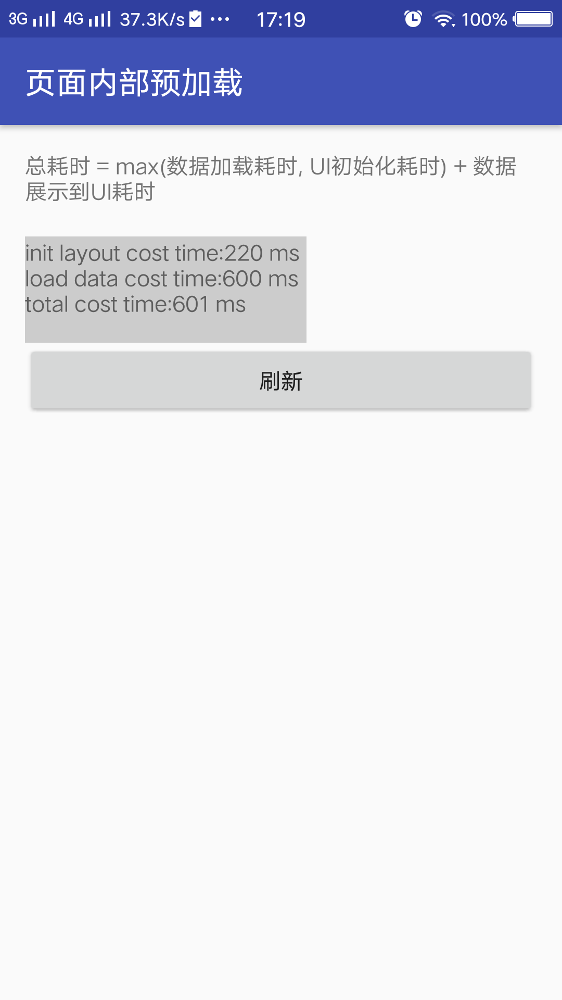
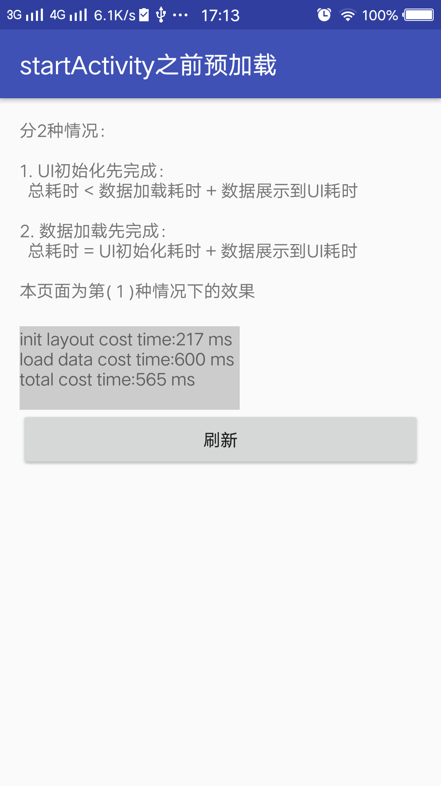
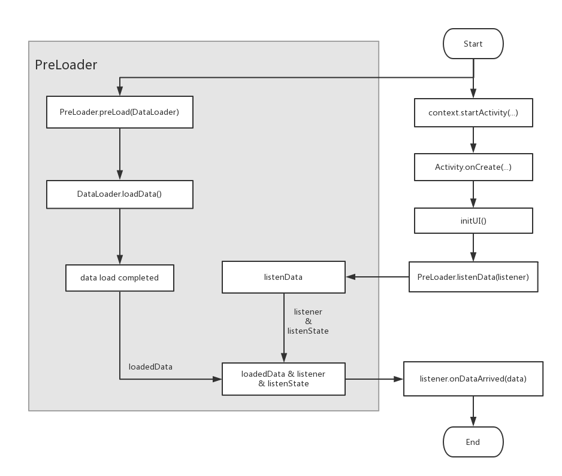

## 预加载：页面启动速度优化利器

最新版本： [](https://bintray.com/hellobilly/android/pre-loader/_latestVersion)


[](https://github.com/luckybilly/PreLoader)
[](https://github.com/luckybilly/PreLoader)

[更新日志](changelog.md)

Activity打开之前就预加载数据，在Activity的UI布局初始化完成后显示预加载的数据，大大缩短启动时间。

在任意处开启预加载任务，并生成任务id，根据任务id可在任意处(一般是UI初始化完成后)开始对预加载的数据进行监听。

- 开始进行监听时，若预加载任务未完成，则等待任务加载完成后执行监听对象的回调方法
- 开始进行监听时，若预加载任务已完成，则直接执行监听对象的回调方法

持续优化中，欢迎watch、star关注！

## demo

[demo下载](demo.apk)

  


## 典型应用

1. 在Application.onCreate中加载地址数据，在需要用到地址的页面中获取预加载的数据
2. 在启动页中预加载app主页所需的数据，减少用户等待时间
3. startActivity之前就开始预加载，UI初始化完成后显示预加载的数据
4. 复杂页面(UI初始化耗时较多的页面)内部在UI初始化开始之前预加载数据，UI初始化完成后显示预加载的数据
5. ListView/RecyclerView在上拉加载更多之前预加载下一页的数据

## 功能列表

- 支持网络数据、网络图片、本地图片、数据库查询及文件I/O等各种耗时操作的预加载
- 支持跨Activity预加载
- 支持下拉刷新(DataLoader重新加载一遍，加载完成后，回调所有DataListener)
- 支持自定义线程池
- 支持一个加载任务(DataLoader)对应多个监听器(DataListener)
- 支持为一个Activity配置多个预加载任务
- 支持后续添加/移除监听器(DataListener)



## 使用方法

1. 在build.gradle中添加依赖
```groovy
dependencies {
    compile 'com.billy.android:pre-loader:x.x.x'
}
```

2. 开启预加载任务（如：在startActivity之前开启）
```java
int preLoaderId = PreLoader.preLoad(new Loader());
Intent intent = new Intent(this, PreLoadBeforeLaunchActivity.class);
intent.putExtra("preLoaderId", preLoaderId);
startActivity(intent);

//预加载任务：模拟网络接口请求获取数据
class Loader implements DataLoader<String> {
    @Override
    public String loadData() {
        try {
            Thread.sleep(600);
        } catch (InterruptedException ignored) {
        }
        return "data from network server";
    }
}
```

3. 在Activity(或Fragment)中UI初始化完成后开始监听预加载数据
```java

PreLoader.listenData(preLoaderId, new Listener());

//数据加载完成后，会调用DataListener.onDataArrived(...)来处理加载后的数据
class Listener implements DataListener<String> {
    @Override
    public void onDataArrived(String data) {
        Toast.makeText(activity, data, Toast.LENGTH_SHORT).show();
    }
}
```

4. 刷新数据，DataLoader会重新加载一遍数据，加载完成后，所有的DataListener的回调方法会被执行
```java
PreLoader.refresh(preLoaderId);
```

5. 在使用完成后可以对预加载任务进行销毁(如：在onDestroy中)
```java
PreLoader.destroy(preLoaderId);
```

## 配合组件化开发框架( CC )使用效果更佳

[CC](https://github.com/luckybilly/CC)框架自带组件层级的AOP，在组件被调用打开Activity之前进行预加载，不需要在每个打开这个Activity的地方调用预加载。

组件定义打开Activity的功能：

```java
public class ComponentA implements IComponent {

    @Override
    public String getName() {
        return "demo.ComponentA";
    }

    @Override
    public boolean onCall(CC cc) {
        int preLoaderId = PreLoader.preLoad(new Loader());
        Intent intent = new Intent(this, PreLoadBeforeLaunchActivity.class);
        intent.putExtra("preLoaderId", preLoaderId);
        startActivity(intent);
        CC.sendCCResult(cc.getCallId(), CCResult.success());
        return false;
    }
}
```

调用打开PreLoadBeforeLaunchActivity的组件：

```java
//不需要执行预加载，加载数据的逻辑在页面所属的组件内部完成
CC.obtainBuilder("demo.ComponentA").build().call();
```

