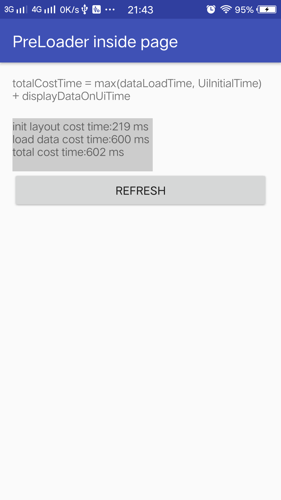
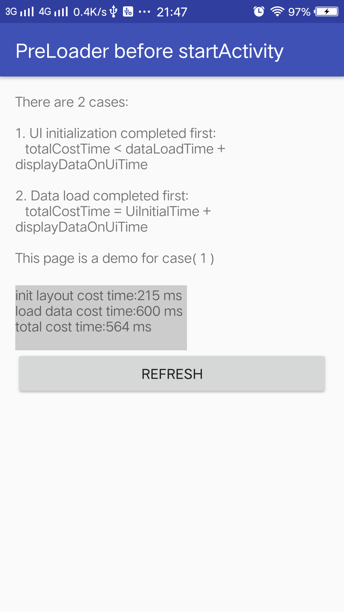
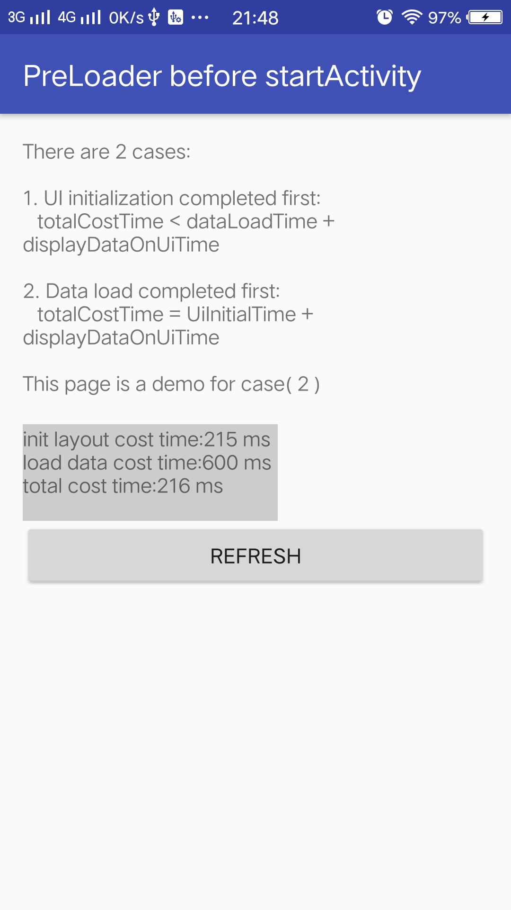

## PreLoader: Make your activity launch faster

[](https://bintray.com/hellobilly/android/pre-loader/_latestVersion)

[changelog](changelog.md)

[中文文档](README-zh-CN.md)

Pre-load data before Activity opens, and display data on UI after UI initialization. Speedup Activity launch

You can start a PreLoader everywhere and start to listen data which loaded by the PreLoader with preLoaderId

- if DataLoader.loadData() is not completed, then DataListener.onDataArrived() will be called after the data load is completed

- if DataLoader.loadData() is completed, then DataListener.onDataArrived() called immediately

Continuous optimization, welcome watch, star!

## demo

[demo download](demo.apk)

  


## Typically used for

1. Pre-load data in Application.onCreate for HomePageActivity to reduce the user waiting time in HomePageActivity initialization

2. Pre-load data before context.startActivity(), and display data after activity UI are initialized

3. Pre-load data for complex UI Activity (UI initialization cost too much time)

## Features

- support network data, network images, local images, database queries, and file I/O

- support for cross-activity pre-loading

- support pull-down refresh (DataLoader reloads once, after loading completes, callback for all DataListener)

- supports custom thread-pool

- support one loader (DataLoader) for multiple listeners (DataListener)

- support multiple preload tasks for an Activity


## Usage

1. add dependencies in build.gradle
```groovy
dependencies {
    compile 'com.billy.android:pre-loader:x.x.x'
}
```

2. start a pre-load
```java
int preLoaderId = PreLoader.preLoad(new Loader());
Intent intent = new Intent(this, PreLoadBeforeLaunchActivity.class);
intent.putExtra("preLoaderId", preLoaderId);
startActivity(intent);

//DataLoader, mock as load data from network
class Loader implements DataLoader<String> {
    @Override
    public String loadData() {
        try {
            Thread.sleep(600);
        } catch (InterruptedException ignored) {
        }
        return "data from network server";
    }
}
```

3. Listen data after UI initialization in Activity/Fragment/View
```java

PreLoader.listenData(preLoaderId, new Listener());

//after data load completed，DataListener.onDataArrived(...) will be called to process data
class Listener implements DataListener<String> {
    @Override
    public void onDataArrived(String data) {
        Toast.makeText(activity, data, Toast.LENGTH_SHORT).show();
    }
}
```

4. Refresh data: DataLoader.loadData() will be called, and DataListener.onDataArrived() will be called for all listeners
```java
PreLoader.refresh(preLoaderId);
```

5. Destroy the PreLoader object if you do not need it(eg. Activity is destroyed)
```java
PreLoader.destroy(preLoaderId);
```

## Better to use with the componentized architecture framework  (CC)

[CC](https://github.com/luckybilly/CC) framework comes with AOP at the component level: when component is calling for start an activity, you can start a pre-load for it. So, it is not need to do pre-load work in every place where you want to start the Activity.

1. define a component for open the activity
```java
public class ComponentA implements IComponent {

    @Override
    public String getName() {
        return "demo.ComponentA";
    }

    @Override
    public boolean onCall(CC cc) {
        int preLoaderId = PreLoader.preLoad(new Loader());
        Intent intent = new Intent(this, PreLoadBeforeLaunchActivity.class);
        intent.putExtra("preLoaderId", preLoaderId);
        startActivity(intent);
        CC.sendCCResult(cc.getCallId(), CCResult.success());
        return false;
    }
}
```

call that component by CC to open activity
```java
// pre-load is needless here, the logistic of component are all inside that component itself
CC.obtainBuilder("demo.ComponentA").build().call();
```

